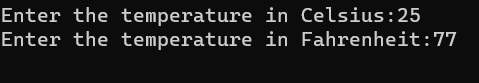
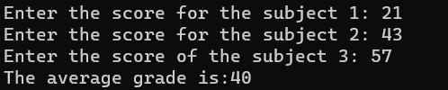
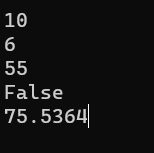
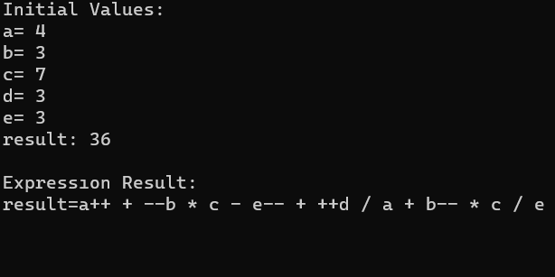
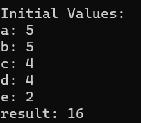
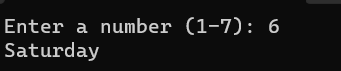
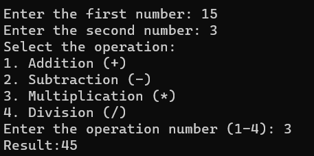
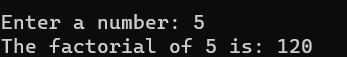

# console.app.csharp

1.Simple Creature

2.Holmes Creature

3.Selsi_Faranheit

4.Score Average

5.Convert Variable

6.Task6

7.Task7

8.Task 8

9.checknumber

10.thedayoftheweek

11.calculation

12.factorial

13.score

14.factorial2

15.swap

16.sumofevennumbers

17.maxvalueinarray

18.minvalueinarray

19.arraytask
